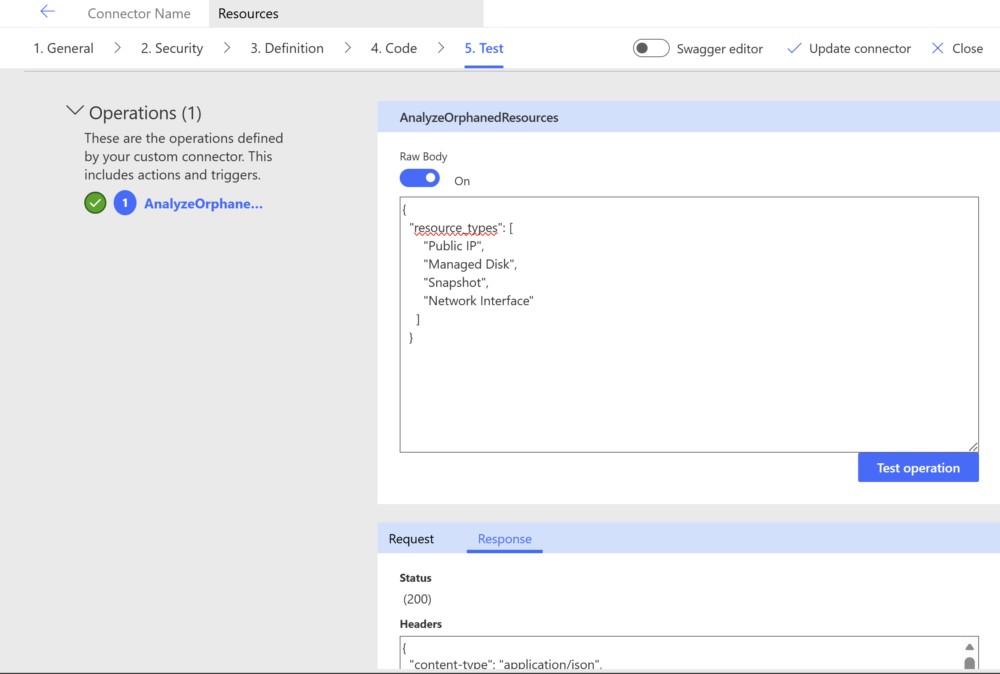

# Azure Cost Optimization Agent - Copilot Studio Setup

> **💡 Note**: This folder contains the **Microsoft Copilot Studio** agent deployment configuration. The Azure Functions backend is deployed from the **root directory**. For the **Azure AI Foundry** agent deployment, see the `/Foundry` folder.

## Overview

This guide explains how to integrate the Azure Cost Optimization Agent (deployed from the root directory) with Microsoft Copilot Studio using custom connectors. The backend Azure Functions API provides endpoints for identifying orphaned resources and analyzing Azure costs.

## 🎯 Purpose

This project helps organizations optimize Azure spending by:

- **Detecting Orphaned Resources**: Identifies unused resources consuming budget (unattached disks, public IPs, network interfaces, snapshots)
- **Cost Analysis**: Calculates actual costs for specific resources, subscriptions, or resource groups
- **Azure Hybrid Benefit Detection**: Finds VMs eligible for AHB but not using it
- **Advisor Recommendations**: Surfaces Azure Advisor cost optimization suggestions
- **Tenant-Wide Analysis**: Supports multi-subscription scanning across an entire Azure tenant

## 🏗️ Architecture

```
┌─────────────────────────────────────────────────────────────┐
│           AI Agent (Microsoft Copilot Studio)               │
│              Natural Language Interface                     │
└────────────────────┬────────────────────────────────────────┘
                     │ HTTP Requests (JSON)
┌────────────────────▼────────────────────────────────────────┐
│            Azure Functions API (Python 3.x)                 │
│  ┌───────────────────────────────────────────────────────┐  │
│  │ /api/analyze - Orphaned Resource Analyzer             │  │
│  │   • Tenant-wide or single subscription                │  │
│  │   • Retry logic with exponential backoff              │  │
│  └───────────────────────────────────────────────────────┘  │
│  ┌───────────────────────────────────────────────────────┐  │
│  │ /api/cost-analysis - Cost Management Analyzer         │  │
│  │   • Individual resource cost queries                  │  │
│  │   • Circuit breaker for rate limiting                 │  │
│  └───────────────────────────────────────────────────────┘  │
└────────────────────┬────────────────────────────────────────┘
                     │ Azure SDK Calls
┌────────────────────▼────────────────────────────────────────┐
│              Azure Management APIs                          │
│  Compute • Network • Advisor • Cost Management             │
│  Managed Identity Authentication                           │
└─────────────────────────────────────────────────────────────┘
```

### Two-Step Workflow

1. **STEP 1**: Analyze orphaned resources (always performed)
2. **STEP 2**: Calculate costs (optional, only when explicitly requested)

## 🚀 Features

### Orphaned Resource Detection

- **Unattached Public IPs**: Unused IP addresses incurring charges
- **Unattached Managed Disks**: Disks not attached to any VM
- **Old Snapshots**: Snapshots older than specified threshold
- **Unattached Network Interfaces**: NICs not attached to VMs
- **VMs Without Azure Hybrid Benefit**: Windows Server and Linux (RHEL/SLES) VMs eligible for AHB savings
- **Azure Advisor Recommendations**: Cost optimization suggestions

### Cost Analysis Capabilities

- **Subscription-Level Costs**: Total costs with service breakdown
- **Resource Group Costs**: Aggregate costs by resource group
- **Service-Specific Costs**: Filter by Azure service names
- **Top N Most Expensive Resources**: Identify cost outliers
- **Specific Resource Costs**: Precise costs for individual resource IDs
- **Budget vs Actual Analysis**: Compare spending against budgets
- **Regional Cost Breakdown**: Costs grouped by Azure region

### Advanced Features

- **Multi-Subscription Support**: Tenant-wide analysis across all accessible subscriptions
- **Intelligent Retry Logic**: Automatic exponential backoff for API rate limiting
- **Circuit Breaker Pattern**: Prevents cascading failures from throttling
- **Smart Date Handling**: Auto-calculates "last 30 days" if dates not provided

## 📋 Prerequisites

### Azure Resources

- **Azure Functions App** (Python 3.9+ runtime)
- **Managed Identity** enabled on the Function App

### Required RBAC Roles

Assign these roles to the Function App's Managed Identity at the appropriate scope (subscription or tenant):

| Role | Purpose |
|------|---------|
| **Cost Management Reader** | Access cost data via Cost Management APIs |
| **Reader** | Enumerate and read resource metadata |
| **Advisor Recommendations Reader** | Retrieve Azure Advisor recommendations |


## 📦 Prerequisites

### 1. Deploy Azure Functions Backend

The Azure Functions backend must be deployed from the **root directory** first:

```bash
# Clone the repository
git clone <repository-url>
cd Azure-CostA-Agantic-AI

# Install dependencies
pip install -r requirements.txt

# Deploy to Azure
az login
func azure functionapp publish <your-function-app-name>
```

For detailed backend deployment instructions, see the [main README](../README.md).

### 2. Configure Managed Identity

```bash
# Enable system-assigned managed identity
az functionapp identity assign --name <your-function-app-name> --resource-group <resource-group>

# Assign required roles (example for subscription scope)
SUBSCRIPTION_ID=$(az account show --query id -o tsv)
PRINCIPAL_ID=$(az functionapp identity show --name <your-function-app-name> --resource-group <resource-group> --query principalId -o tsv)

az role assignment create --assignee $PRINCIPAL_ID --role "Cost Management Reader" --scope /subscriptions/$SUBSCRIPTION_ID
az role assignment create --assignee $PRINCIPAL_ID --role "Reader" --scope /subscriptions/$SUBSCRIPTION_ID
az role assignment create --assignee $PRINCIPAL_ID --role "Advisor Recommendations Reader" --scope /subscriptions/$SUBSCRIPTION_ID
```

## 🔌 API Endpoints

### 1. Analyze Orphaned Resources

**Endpoint**: `POST /api/analyze`

**Authentication**: Function key required (`code` query parameter)

#### Request Body

```json
{
  "analysis_scope": "single_subscription",
  "subscription_ids": ["12345678-1234-1234-1234-123456789abc"],
  "resource_types": ["Public IP", "Managed Disk", "Network Interface"],
  "include_advisor_recommendations": true,
  "include_costs": false,
  "start_date": "2025-12-01T00:00:00Z",
  "end_date": "2025-12-31T23:59:59Z"
}
```

#### Parameters

| Parameter | Type | Required | Description |
|-----------|------|----------|-------------|
| `analysis_scope` | string | No | `single_subscription`, `subscription_list`, or `tenant_wide` (default: `single_subscription`) |
| `subscription_ids` | array | Conditional | Required for `single_subscription` and `subscription_list` |
| `resource_types` | array | No | Filter specific types: `"Public IP"`, `"Managed Disk"`, `"Snapshot"`, `"Network Interface"`, `"VM without AHB"` |
| `include_advisor_recommendations` | boolean | No | Include Azure Advisor cost recommendations (default: `true`) |
| `include_costs` | boolean | No | Include cost data for orphaned resources (default: `false`) |
| `start_date` | string | No | Start date for cost analysis (ISO 8601 format) |
| `end_date` | string | No | End date for cost analysis (ISO 8601 format) |

#### Example Request

```bash
curl -X POST "https://<your-function-app>.azurewebsites.net/api/analyze?code=<function-key>" \
  -H "Content-Type: application/json" \
  -d '{
    "analysis_scope": "single_subscription",
    "subscription_ids": ["12345678-1234-1234-1234-123456789abc"],
    "resource_types": ["Public IP", "Managed Disk"],
    "include_advisor_recommendations": true
  }'
```

#### Response

```json
{
  "status": "success",
  "summary": {
    "total_orphaned_resources": 15,
    "by_type": {
      "Public IP": 5,
      "Managed Disk": 8,
      "Network Interface": 2
    },
    "total_subscriptions_analyzed": 1,
    "potential_monthly_savings": "$125.50"
  },
  "orphaned_resources": [
    {
      "type": "Public IP",
      "name": "unused-ip-01",
      "resource_group": "rg-production",
      "location": "eastus",
      "subscription_id": "12345678-1234-1234-1234-123456789abc",
      "subscription_name": "Production",
      "resource_id": "/subscriptions/.../publicIPAddresses/unused-ip-01",
      "estimated_monthly_cost": "$3.50"
    }
  ],
  "advisor_recommendations": [
    {
      "category": "Cost",
      "impact": "High",
      "description": "Resize or shutdown underutilized VMs",
      "potential_savings": "$500/month"
    }
  ]
}
```

### 2. Cost Analysis

**Endpoint**: `POST /api/cost-analysis`

**Authentication**: Function key required

#### Request Body

```json
{
  "subscription_id": "12345678-1234-1234-1234-123456789abc",
  "query_type": "specific_resources",
  "resource_ids": [
    "/subscriptions/12345678-1234-1234-1234-123456789abc/resourceGroups/rg-prod/providers/Microsoft.Compute/virtualMachines/vm-web-01",
    "/subscriptions/12345678-1234-1234-1234-123456789abc/resourceGroups/rg-prod/providers/Microsoft.Compute/disks/disk-data-01"
  ],
  "start_date": "2025-12-01T00:00:00Z",
  "end_date": "2025-12-31T23:59:59Z"
}
```

#### Parameters

| Parameter | Type | Required | Description |
|-----------|------|----------|-------------|
| `subscription_id` | string | Yes | Azure subscription ID |
| `query_type` | string | Yes | `subscription`, `resource_group`, `service`, `top_resources`, `specific_resources`, `budget_vs_actual`, `by_region` |
| `resource_ids` | array | Conditional | Required for `specific_resources` query type |
| `resource_group_name` | string | Conditional | Required for `resource_group` query type |
| `service_names` | array | Conditional | Required for `service` query type |
| `top_n` | integer | No | Number of top resources (default: 10) for `top_resources` |
| `budget_name` | string | Conditional | Required for `budget_vs_actual` |
| `start_date` | string | No | Start date (defaults to 30 days ago) |
| `end_date` | string | No | End date (defaults to today) |

#### Query Types

**1. Subscription-Level Costs**

```json
{
  "subscription_id": "12345678-1234-1234-1234-123456789abc",
  "query_type": "subscription",
  "start_date": "2025-12-01T00:00:00Z",
  "end_date": "2025-12-31T23:59:59Z"
}
```

**2. Resource Group Costs**

```json
{
  "subscription_id": "12345678-1234-1234-1234-123456789abc",
  "query_type": "resource_group",
  "resource_group_name": "rg-production",
  "start_date": "2025-12-01T00:00:00Z",
  "end_date": "2025-12-31T23:59:59Z"
}
```

**3. Specific Resource Costs**

```json
{
  "subscription_id": "12345678-1234-1234-1234-123456789abc",
  "query_type": "specific_resources",
  "resource_ids": [
    "/subscriptions/.../virtualMachines/vm-web-01",
    "/subscriptions/.../disks/disk-data-01"
  ],
  "start_date": "2025-12-01T00:00:00Z",
  "end_date": "2025-12-31T23:59:59Z"
}
```

**4. Top N Most Expensive Resources**

```json
{
  "subscription_id": "12345678-1234-1234-1234-123456789abc",
  "query_type": "top_resources",
  "top_n": 10,
  "start_date": "2025-12-01T00:00:00Z",
  "end_date": "2025-12-31T23:59:59Z"
}
```

#### Response

```json
{
  "status": "success",
  "total_cost": 1245.67,
  "currency": "USD",
  "date_range": {
    "start": "2025-12-01T00:00:00Z",
    "end": "2025-12-31T23:59:59Z"
  },
  "resources": [
    {
      "resource_id": "/subscriptions/.../virtualMachines/vm-web-01",
      "resource_name": "vm-web-01",
      "resource_type": "Microsoft.Compute/virtualMachines",
      "cost": 856.34,
      "daily_costs": [
        {"date": "2025-12-01", "cost": 27.62},
        {"date": "2025-12-02", "cost": 27.62}
      ]
    },
    {
      "resource_id": "/subscriptions/.../disks/disk-data-01",
      "resource_name": "disk-data-01",
      "resource_type": "Microsoft.Compute/disks",
      "cost": 389.33,
      "daily_costs": [
        {"date": "2025-12-01", "cost": 12.56},
        {"date": "2025-12-02", "cost": 12.56}
      ]
    }
  ]
}
```

### 3. Example Endpoints

#### Get Orphaned Resources Examples

**Endpoint**: `GET /api/example`

Returns example query payloads for the `/api/analyze` endpoint.

#### Get Cost Analysis Examples

**Endpoint**: `GET /api/cost-example`

Returns example query payloads for the `/api/cost-analysis` endpoint.

## 🤖 AI Agent Integration

### Microsoft Copilot Studio Setup

1. **Import Custom Connectors**
   - Navigate to Copilot Studio → tools → new tool → custom connector
   - Create new connector from OpenAPI definition
   - Upload `CopilotStudioAgent/Orphand connector swagger.yaml` (orphaned resources only)
   - On the test page, test the endpoints to ensure connectivity - add the function key and test using sample payloads for example:
   ```json
   {
       "resource_types": [
         "Public IP",
         "Managed Disk",
         "Snapshot",
         "Network Interface"
       ]
   }
   ```
   
   
   Repeat the process for the cost analysis connector using `CopilotStudioAgent/Cost-Connector swagger.yaml` with a test payload like:
   ```json
   {
       "subscription_id": "12345678-1234-1234-1234-123456789abc",
       "query_type": "specific_resources",
       "resource_ids": [
         "/subscriptions/12345678-1234-1234-1234-123456789abc/resourceGroups/rg-prod/providers/Microsoft.Compute/virtualMachines/vm-web-01"
       ],
       "start_date": "2025-12-01T00:00:00Z",
       "end_date": "2025-12-31T23:59:59Z"
   }
   ```

2. **Configure Authentication**
   - Set authentication type to "API Key"
   - Configure function key in connector settings
   - Parameter name: `code`
   - Location: Query string

3. **Create Agent Actions**
   - Add "Analyze Orphaned Resources" action
   - Add "Calculate Resource Costs" action (if using full connector)
   - Map response properties to agent variables

### Agent Behavior Instructions

#### Orphaned Resources Only Agent

```
AGENT INSTRUCTIONS:
- You are an Azure cost optimization assistant
- Your ONLY role is to find orphaned/unused Azure resources
- NEVER provide cost estimates or pricing information
- Default to 'single_subscription' scope unless user specifies otherwise
- If subscription ID not provided, ask the user
- Show up to 10 resources with a summary
- Suggest actions: delete unused resources, review old snapshots, enable AHB
```

#### Full Cost Analysis Agent

```
AGENT INSTRUCTIONS:
- You are an Azure FinOps assistant helping optimize cloud costs
- TWO-STEP WORKFLOW:
  STEP 1: Always analyze orphaned resources first
  STEP 2: Calculate costs ONLY if user explicitly mentions cost/spend/price

- COST ANALYSIS TRIGGERS:
  "How much", "cost", "spend", "price", "expensive", "budget"
  
- SMART DATE INTERPRETATION:
  "last month" → previous calendar month
  "past 30 days" → 30 days from today
  "this month" → current month to date
  "Q4" → October 1 - December 31
  
- DEFAULT BEHAVIOR:
  If dates not specified, use past 30 days
  
- RESOURCE IDENTIFICATION:
  Extract resource IDs from previous analysis results
  Use resource names from user's natural language query
  
- ALWAYS provide actionable recommendations based on findings
```

## 🔧 Configuration

### Function App Settings

| Setting | Value | Description |
|---------|-------|-------------|
| `FUNCTIONS_WORKER_RUNTIME` | `python` | Runtime environment |
| `AzureWebJobsStorage` | Connection string | Storage for function state |
| Authorization Level | `function` | Requires function key |

### Rate Limiting Strategy

The application implements sophisticated rate limiting handling:

- **Custom `ClientType` Header**: Bypasses some Azure Cost Management API limits
- **Exponential Backoff**: Automatic retry with increasing delays
- **Circuit Breaker**: Stops requests after consecutive rate limit failures
- **Per-Resource Queries**: Queries each resource individually for accuracy

## 📊 Usage Examples

### Scenario 1: Find All Orphaned Resources in a Subscription

```bash
curl -X POST "https://your-app.azurewebsites.net/api/analyze?code=YOUR_KEY" \
  -H "Content-Type: application/json" \
  -d '{
    "analysis_scope": "single_subscription",
    "subscription_ids": ["YOUR_SUBSCRIPTION_ID"],
    "include_advisor_recommendations": true
  }'
```

### Scenario 2: Tenant-Wide Orphaned Resource Scan

```bash
curl -X POST "https://your-app.azurewebsites.net/api/analyze?code=YOUR_KEY" \
  -H "Content-Type: application/json" \
  -d '{
    "analysis_scope": "tenant_wide",
    "resource_types": ["Public IP", "Managed Disk"],
    "include_advisor_recommendations": true
  }'
```

### Scenario 3: Calculate Costs for Specific Resources

```bash
curl -X POST "https://your-app.azurewebsites.net/api/cost-analysis?code=YOUR_KEY" \
  -H "Content-Type: application/json" \
  -d '{
    "subscription_id": "YOUR_SUBSCRIPTION_ID",
    "query_type": "specific_resources",
    "resource_ids": [
      "/subscriptions/YOUR_SUBSCRIPTION_ID/resourceGroups/rg-prod/providers/Microsoft.Compute/virtualMachines/vm-01"
    ],
    "start_date": "2025-12-01T00:00:00Z",
    "end_date": "2025-12-31T23:59:59Z"
  }'
```

### Scenario 4: Find Top 10 Most Expensive Resources

```bash
curl -X POST "https://your-app.azurewebsites.net/api/cost-analysis?code=YOUR_KEY" \
  -H "Content-Type: application/json" \
  -d '{
    "subscription_id": "YOUR_SUBSCRIPTION_ID",
    "query_type": "top_resources",
    "top_n": 10,
    "start_date": "2025-12-01T00:00:00Z",
    "end_date": "2025-12-31T23:59:59Z"
  }'
```

### Scenario 5: Analyze Multiple Subscriptions

```bash
curl -X POST "https://your-app.azurewebsites.net/api/analyze?code=YOUR_KEY" \
  -H "Content-Type: application/json" \
  -d '{
    "analysis_scope": "subscription_list",
    "subscription_ids": [
      "12345678-1234-1234-1234-123456789abc",
      "87654321-4321-4321-4321-cba987654321"
    ],
    "resource_types": ["Managed Disk", "Snapshot"],
    "include_advisor_recommendations": true
  }'
```

## 🐛 Troubleshooting

### Authentication Errors

**Error**: `403 Forbidden` or `Authorization failed`

**Solution**:
- Verify Managed Identity is enabled on Function App
- Check RBAC role assignments at correct scope
- Ensure roles include Cost Management Reader, Reader, and Advisor Recommendations Reader
- Allow 5-10 minutes for role assignments to propagate

```bash
# Verify role assignments
az role assignment list --assignee <managed-identity-principal-id> --all
```

### Rate Limiting (429 Errors)

**Error**: `429 Too Many Requests` from Azure Cost Management API

**Solution**:
- The application automatically retries with exponential backoff
- For persistent issues, reduce the number of resources analyzed per call
- Consider spreading analysis across multiple time periods
- Azure Cost Management API has strict quotas (check Azure documentation)

### Missing Cost Data

**Error**: No cost data returned for resources

**Possible Causes**:
1. **Insufficient permissions**: Ensure Cost Management Reader role
2. **Recent resources**: Cost data may take 24-48 hours to appear
3. **Date range too recent**: Use dates at least 2-3 days in the past
4. **Resource never incurred costs**: Some resources are free tier

**Solution**:
```bash
# Test with known resources and older date range
{
  "start_date": "2025-11-01T00:00:00Z",
  "end_date": "2025-11-30T23:59:59Z"
}
```

### Tenant-Wide Analysis Failures

**Error**: Cannot enumerate subscriptions

**Solution**:
- Ensure Managed Identity has Reader role at **Management Group** or **Root** level
- Verify the identity has access to subscriptions (not just resource groups)
- Check subscription state (Disabled subscriptions are skipped)

```bash
# Grant Reader role at tenant root (requires high privileges)
az role assignment create \
  --assignee <principal-id> \
  --role "Reader" \
  --scope "/"
```

### Timeout Issues

**Error**: Function execution timeout

**Solution**:
- Reduce `analysis_scope` from `tenant_wide` to `subscription_list` with fewer subscriptions
- Limit `resource_types` to specific types
- Increase Function App timeout (Function App Settings → Configuration)
- Consider using Azure Functions Premium Plan for longer timeouts

### Invalid Resource IDs

**Error**: `400 Bad Request` - Invalid resource ID format

**Solution**:
Resource IDs must be full Azure Resource Manager IDs:

```
✅ Correct:
/subscriptions/{sub-id}/resourceGroups/{rg}/providers/Microsoft.Compute/virtualMachines/{name}

❌ Incorrect:
vm-name
/resourceGroups/rg/virtualMachines/vm-name
```

## 📝 Development

### Project Structure

```
Azure-CostA-Agantic-AI/
├── function_app.py              # Azure Functions backend (deploy from root)
├── host.json
├── requirements.txt
├── README.md                    # Backend documentation
├── Foundry/                     # Azure AI Foundry agent deployment
│   ├── Agents/
│   └── mcp/
└── CopilotStudio/               # This folder - Copilot Studio setup
    ├── README.md                # This file
    └── CopilotStudioAgent/      # Custom connector configuration
        ├── Cost-Connector swagger.yaml        # Full API OpenAPI spec
        ├── Orphand connector swagger.yaml     # Orphaned resources only
        ├── AgentInstractions.txt              # Agent behavior guide
        └── image.png                          # Connector icon
```

### Key Classes

- **`OrphanedResourceAnalyzer`**: Identifies unused Azure resources across subscriptions
- **`CostManagementAnalyzer`**: Queries Azure Cost Management API with retry logic and circuit breaker

### Running Locally

```bash
# Install Azure Functions Core Tools
npm install -g azure-functions-core-tools@4

# Start local development server
func start

# Test endpoints
curl http://localhost:7071/api/analyze -X POST -d @test-payload.json
```

### Testing

```bash
# Test with single subscription
curl -X POST "http://localhost:7071/api/analyze" \
  -H "Content-Type: application/json" \
  -d '{
    "analysis_scope": "single_subscription",
    "subscription_ids": ["YOUR_TEST_SUBSCRIPTION"]
  }'
```

## 🔒 Security Best Practices

1. **Never commit function keys** to version control
2. **Use Managed Identity** instead of service principals where possible
3. **Enable Application Insights** for monitoring and diagnostics
4. **Restrict network access** using Function App networking features
5. **Rotate function keys** periodically
6. **Use Azure Key Vault** for sensitive configuration
7. **Enable HTTPS only** in Function App settings

## 📚 References

- [Azure Functions Python Developer Guide](https://learn.microsoft.com/azure/azure-functions/functions-reference-python)
- [Azure Cost Management REST API](https://learn.microsoft.com/rest/api/cost-management/)
- [Azure Advisor Documentation](https://learn.microsoft.com/azure/advisor/)
- [Microsoft Copilot Studio Custom Connectors](https://learn.microsoft.com/power-virtual-agents/advanced-fundamentals)
- [Azure Hybrid Benefit](https://azure.microsoft.com/pricing/hybrid-benefit/)

## 🤝 Contributing

Contributions are welcome! Please ensure:
- Code follows PEP 8 style guidelines
- All functions include docstrings
- Error handling is comprehensive
- Rate limiting logic is preserved

## 📄 License

[Specify your license here]

## 🆘 Support

For issues and questions:
- Create an issue in the repository
- Contact the Azure FinOps team
- Review Azure Cost Management API documentation

---

**Last Updated**: December 29, 2025  
**Version**: 1.0.0  
**Python Version**: 3.9+  
**Azure Functions Runtime**: 4.x
